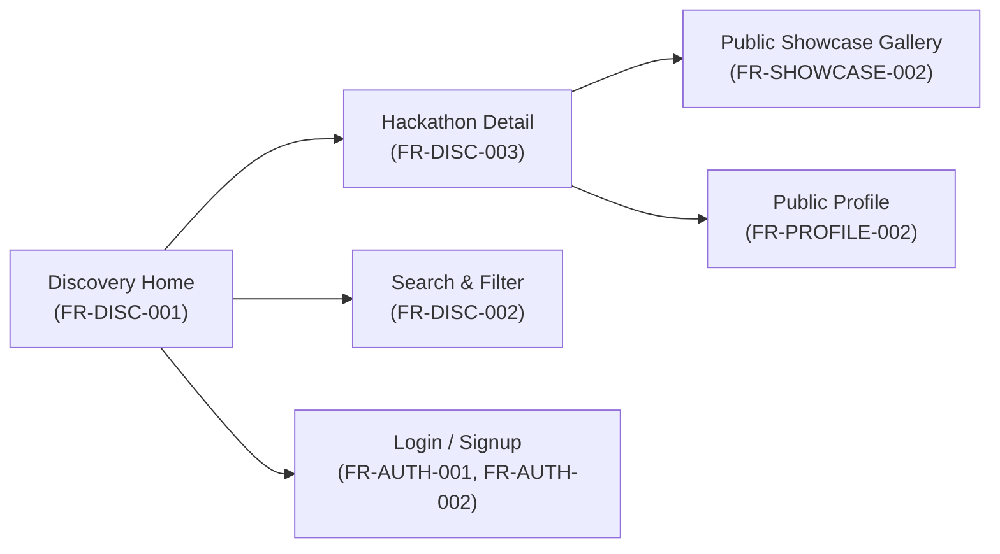
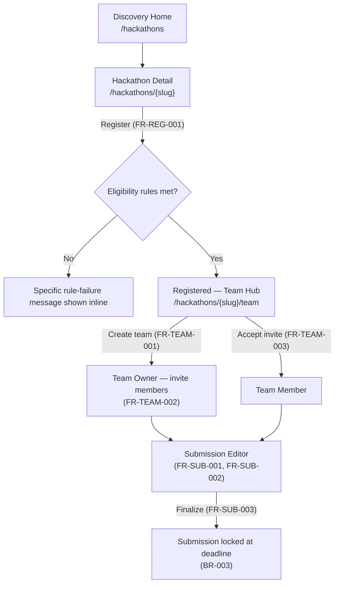
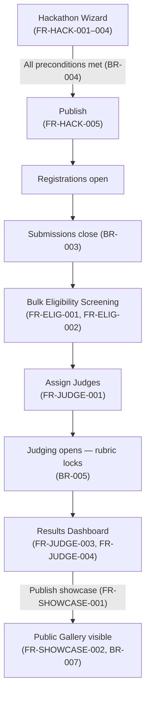
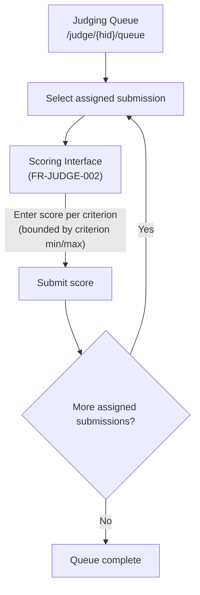
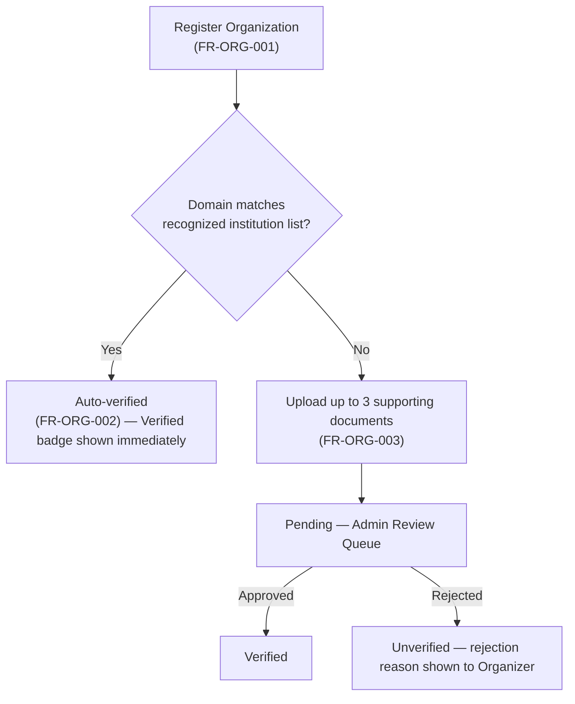

# 06 — UI/UX Specification

**Document type:** UI/UX Specification
**Audience:** Frontend engineers, product designers, QA engineers, technical reviewers
**Status:** Complete — derived from and traceable to the SRS and SDS
**Related documents:** [02 — Software Requirements Specification](02-software-requirements-specification.md) (source of every `FR-*` this document exposes to a user) · [03 — Software Design Specification](03-software-design-specification.md), [Section 7](03-software-design-specification.md#7-frontend-architecture) (rendering strategy, state management, and component organization this document's screens conform to) · [04 — API Specification](04-openapi-specification.yaml) (the contract each screen's data comes from) · [07 — Testing and Quality Assurance](07-testing-and-quality-assurance.md) (usability and accessibility test methods)

---

## 1. Introduction

### 1.1 Purpose

This document specifies **what the user sees and does**: the screen inventory, information architecture, key flows, and design-system rules for the Ethiopia Innovation Hub. Every screen in this document exposes one or more `FR-*` requirements from [Document 02](02-software-requirements-specification.md), and every screen's rendering strategy and component boundaries follow the frontend architecture already fixed in [Document 03, Section 7](03-software-design-specification.md#7-frontend-architecture). This document introduces no new product behavior — only the presentation and interaction layer for behavior already specified.

### 1.2 Scope

This document covers: the design-system foundations shared across every screen (Section 3), the information architecture per role (Section 4), the full screen inventory with `FR-*` traceability (Section 5), the key end-to-end user flows (Section 6), the shared component library's organization (Section 7), accessibility and responsive design rules (Section 8), bilingual localization behavior at the UI level (Section 9), and error/empty/loading state conventions (Section 10). It does not cover visual brand assets (logo, final color palette, imagery) or pixel-level mockups — those are a design-tool deliverable outside this document's scope and are referenced here only as design tokens.

### 1.3 Roles

Per [Document 02, Section 1.4](02-software-requirements-specification.md#14-roles-referenced-in-this-document), this document uses the same six roles: `Participant`, `Organizer`, `Sponsor`, `Judge`, `Mentor`, `Platform Admin`. A single account may hold different roles in different contexts (Document 02, Section 2.2); the UI reflects this by scoping role-specific navigation to the hackathon or organization context the user is currently acting within, never showing a global "mode switch."

---

## 2. Design Principles

| Principle | Implication |
|---|---|
| **Low-bandwidth first** | Every public, unauthenticated screen is designed to meet NFR-USE-002 (fully functional on simulated 3G, ≤2 MB per core flow) and NFR-PERF-004 (LCP < 2.5s on 3G). Hero imagery is optional and lazy-loaded; no screen's core function depends on an image loading. |
| **Server is the source of truth** | Per [Document 03, Section 7.2](03-software-design-specification.md#72-state-management), no screen renders a business-rule-governed state (e.g., "is registration still open") from client-held state alone; every such display re-validates against the API response, so a stale client clock or cached page never shows a participant an action that the server will actually reject. |
| **One error contract, one error experience** | Every form on every screen renders validation errors using the single envelope shape defined in [Document 03, Section 6.5](03-software-design-specification.md#65-error-handling-and-api-response-contract) — inline, field-adjacent, in the active interface language (NFR-USE-003) — so the interaction pattern is identical whether the form is login, hackathon creation, or judging score entry. |
| **Bilingual by construction, not by translation layer** | English and Amharic are both first-class; no screen is designed in English and "translated after." Layouts accommodate roughly 20–30% text-length variance between the two languages (Amharic strings are frequently longer) without truncation or overflow, since Document 03 §6.4 requires both catalogs to ship together. |
| **Progressive disclosure by role** | A participant-facing screen never exposes organizer, judge, or admin controls conditionally hidden by CSS; role-gated UI elements are only rendered when the authenticated user's role for that specific resource is confirmed by the API response, consistent with [Document 03, Section 4.3](03-software-design-specification.md#43-authorization-model-rbac-tenant-scoped) treating client-side role display as informational, never authoritative. |

---

## 3. Design System Foundations

### 3.1 Typography

| Token | Value | Rationale |
|---|---|---|
| `font-latin` | A humanist sans-serif with full Latin coverage (e.g., Inter or system-ui stack) | Body and UI text in English. |
| `font-ethiopic` | A sans-serif with full Ethiopic (Ge'ez) block coverage (e.g., Noto Sans Ethiopic) | Amharic text renders in this stack; the font-loading strategy pairs it with `font-latin` via CSS `font-family` fallback lists rather than swapping stylesheets per locale, so mixed-language content (a user's Amharic bio inside an otherwise-English admin screen) never falls back to tofu glyphs. |
| Type scale | `text-xs` (12px) through `text-4xl` (36px), 6 steps, 1.25 ratio | Applied identically in both languages; Ethiopic script's taller x-height is accommodated by a shared `line-height` token (1.5) rather than a per-language override, keeping vertical rhythm predictable across a bilingual page. |

### 3.2 Color roles

Colors are specified as semantic roles, not literal hex values, since final brand color selection is a design-tool deliverable outside this document's scope:

| Role token | Usage |
|---|---|
| `color-primary` | Primary actions (Register, Submit, Publish), active nav state. |
| `color-surface` / `color-surface-alt` | Page and card backgrounds, for the light/elevated distinction used across dashboards. |
| `color-text` / `color-text-muted` | Body text and secondary/meta text (timestamps, helper copy). |
| `color-success` / `color-warning` / `color-danger` | Status badges (`verified`/`pending`/`unverified`; `eligible`/`disqualified`) and form validation states. |
| `color-focus` | Focus ring, distinct from `color-primary`, contrast-checked independently to satisfy NFR-ACC-002 (keyboard operability) even where `color-primary` itself might not meet the 3:1 non-text contrast minimum against every surface. |

All role-token pairings are contrast-checked against WCAG 2.1 AA thresholds (4.5:1 text, 3:1 large text/UI components) per NFR-ACC-001, independent of final palette choice.

### 3.3 Spacing and layout grid

- Spacing scale: 4px base unit, steps of 4/8/12/16/24/32/48/64.
- Breakpoints: `sm` 360px (minimum supported width, per NFR-USE-002's mobile-first assumption), `md` 768px, `lg` 1024px, `xl` 1280px.
- Public SSR pages (Section 4) use a 12-column grid at `lg`+ and collapse to single-column below `md`; authenticated CSR dashboards use a fixed sidebar + content layout at `lg`+ and a collapsible drawer below it.

### 3.4 Iconography and imagery

A single icon set is used platform-wide (outline style, 24px base grid) so icons never carry conflicting visual weight between roles. All icons conveying meaning (status, action) carry an accessible label per NFR-ACC-003; purely decorative icons are marked `aria-hidden`.

---

## 4. Information Architecture

### 4.1 Public (unauthenticated) navigation

### 4.2 Authenticated navigation (role-scoped)

The authenticated shell has a persistent top-level switcher between hackathon contexts the user participates in, and a role-aware sidebar whose sections appear only when the user holds that role for the currently selected context:

| Sidebar section | Visible to |
|---|---|
| My Registrations, My Team, My Submission | `Participant` (default section for any authenticated user) |
| Organizer Console (hackathon config, eligibility screening, analytics, tracks) | `Organizer` |
| Sponsor Console (assigned tracks, opted-in submissions) | `Sponsor` |
| Judging Queue | `Judge` |
| Mentor Availability | `Mentor` |
| Platform Admin Console | `Platform Admin` (global; not context-scoped) |
| Account Settings, Language | All authenticated roles |

---

## 5. Screen Inventory

Every screen lists the `FR-*` IDs it exposes, per [Document 02](02-software-requirements-specification.md#4-business-rules), and its rendering strategy per [Document 03, Section 7.1](03-software-design-specification.md#71-structure).

### 5.1 Auth & Profile

| Screen | Route | Rendering | Role(s) | FR IDs exposed |
|---|---|---|---|---|
| Sign up | `/signup` | SSR | Public | FR-AUTH-001 |
| Log in | `/login` | SSR | Public | FR-AUTH-002 |
| Email verification pending / confirm | `/verify-email` | SSR | Public (post-signup) | FR-AUTH-003 |
| Forgot / reset password | `/forgot-password`, `/reset-password` | SSR | Public | FR-AUTH-004 |
| My profile (edit) | `/settings/profile` | CSR | All authenticated | FR-PROFILE-001, FR-PROFILE-003 |
| Public profile | `/u/{username}` | SSR | Public | FR-PROFILE-002 |

### 5.2 Organizations

| Screen | Route | Rendering | Role(s) | FR IDs exposed |
|---|---|---|---|---|
| Register organization | `/orgs/new` | CSR | Authenticated (becomes Organizer) | FR-ORG-001 |
| Organization verification status | `/orgs/{id}/verification` | CSR | Organizer of that org | FR-ORG-002, FR-ORG-003 (document upload; decision display) |
| Admin verification review queue | `/admin/organizations` | CSR | Platform Admin | FR-ORG-003, FR-ADMIN-001 |

### 5.3 Hackathon configuration & discovery

| Screen | Route | Rendering | Role(s) | FR IDs exposed |
|---|---|---|---|---|
| Hackathon creation wizard (basics → timeline → eligibility → rubric → review) | `/orgs/{id}/hackathons/new` | CSR | Organizer | FR-HACK-001 – FR-HACK-004 |
| Hackathon edit / publish | `/orgs/{id}/hackathons/{hid}/edit` | CSR | Organizer | FR-HACK-005 |
| Discovery home | `/hackathons` | SSR (ISR) | Public | FR-DISC-001, FR-DISC-002 |
| Hackathon detail | `/hackathons/{slug}` | SSR (ISR) | Public | FR-DISC-003 |

### 5.4 Registration & Team Formation

| Screen | Route | Rendering | Role(s) | FR IDs exposed |
|---|---|---|---|---|
| Registration form (in hackathon detail) | `/hackathons/{slug}/register` | CSR (auth-gated) | Participant | FR-REG-001 |
| My registrations | `/dashboard/registrations` | CSR | Participant | FR-REG-002, FR-REG-003 |
| Team hub (create / roster / invite) | `/hackathons/{slug}/team` | CSR | Participant | FR-TEAM-001, FR-TEAM-002, FR-TEAM-004, FR-TEAM-005 |
| Invitation inbox | `/dashboard/invitations` | CSR | Participant (invitee) | FR-TEAM-003 |

### 5.5 Submission

| Screen | Route | Rendering | Role(s) | FR IDs exposed |
|---|---|---|---|---|
| Submission editor | `/hackathons/{slug}/submission` | CSR | Participant (team member) | FR-SUB-001, FR-SUB-002 |
| Submission review & finalize | `/hackathons/{slug}/submission/review` | CSR | Participant (team member) | FR-SUB-003 |
| My submission history | `/dashboard/submissions` | CSR | Participant | FR-SUB-004 |

### 5.6 Eligibility & Tracks

| Screen | Route | Rendering | Role(s) | FR IDs exposed |
|---|---|---|---|---|
| Eligibility screening (single) | `/organizer/{hid}/submissions/{sid}/eligibility` | CSR | Organizer | FR-ELIG-001 |
| Bulk screening view | `/organizer/{hid}/eligibility` | CSR | Organizer | FR-ELIG-002 |
| Challenge track management | `/organizer/{hid}/tracks` | CSR | Organizer | FR-TRACK-001, FR-TRACK-002 |
| Sponsor console (assigned track submissions) | `/sponsor/{orgId}/tracks/{trackId}` | CSR | Sponsor | Read scope defined by BR-009 |

### 5.7 Judging & Showcase

| Screen | Route | Rendering | Role(s) | FR IDs exposed |
|---|---|---|---|---|
| Judge assignment | `/organizer/{hid}/judging/assignments` | CSR | Organizer | FR-JUDGE-001 |
| Scoring interface | `/judge/{hid}/queue/{submissionId}` | CSR | Judge | FR-JUDGE-002 |
| Results dashboard | `/organizer/{hid}/judging/results` | CSR | Organizer | FR-JUDGE-003, FR-JUDGE-004 |
| Showcase publish control | `/organizer/{hid}/showcase` | CSR | Organizer | FR-SHOWCASE-001 |
| Public project gallery | `/hackathons/{slug}/showcase` | SSR (ISR) | Public | FR-SHOWCASE-002 |

### 5.8 Notifications, Analytics, Admin

| Screen | Route | Rendering | Role(s) | FR IDs exposed |
|---|---|---|---|---|
| Notification center (in-app) | `/dashboard/notifications` | CSR | All authenticated | FR-NOTIFY-001 |
| Notification preferences (SMS opt-in) | `/settings/notifications` | CSR | All authenticated | FR-NOTIFY-002 |
| Organizer analytics dashboard | `/organizer/{hid}/analytics` | CSR | Organizer | FR-ANALYTICS-001, FR-ANALYTICS-002 |
| Platform-wide admin search | `/admin/search` | CSR | Platform Admin | FR-ADMIN-002 |
| Content moderation queue | `/admin/moderation` | CSR | Platform Admin | FR-ADMIN-001 |

### 5.9 Localization

The language toggle (FR-I18N-001, FR-I18N-002) is not a standalone screen; it is a persistent control in the global header (`components/ui`, Section 7), present on every screen in this inventory.

---

## 6. Key User Flows

### 6.1 Registration → team formation → submission (Participant)

*UI note:* the eligibility-window and team-size checks visualized at C and within the Team Hub are always re-validated against the live API response before rendering the action as available (Section 2's "server is the source of truth" principle) — the button is never shown enabled based on a locally cached deadline.

### 6.2 Organizer: create → publish → screen → judge → showcase

*UI note:* the Publish action at step B is disabled with an inline checklist (title, timeline, eligibility rules, rubric-weights-sum-to-100) rather than a disabled button with no explanation, directly satisfying FR-HACK-005's "rejected with a list of the specific missing fields" acceptance criterion at the UI layer.

### 6.3 Judge scoring session

*UI note:* per BR-008, the scoring interface never displays another judge's identity or score for the same submission — a judge sees only their own in-progress entry.

### 6.4 Organization verification

---

## 7. Component Library Organization

Mirrors the frontend module boundaries fixed in [Document 03, Section 7.3](03-software-design-specification.md#73-component-organization):

| Directory | Contents | Examples |
|---|---|---|
| `components/ui` | Feature-agnostic presentational primitives | Button, TextField, Select, Modal, Toast, LanguageToggle, StatusBadge, ErrorBanner |
| `features/auth` | Auth-specific screens and form logic | SignupForm, LoginForm, PasswordResetFlow |
| `features/hackathons` | Discovery and organizer configuration UI | HackathonCard, HackathonWizard, RubricEditor |
| `features/teams` | Team formation UI | TeamRoster, InviteModal, InvitationInbox |
| `features/submissions` | Submission authoring and review UI | SubmissionEditor, MediaUploader, SubmissionCard |
| `features/judging` | Judge- and organizer-facing judging UI | ScoreEntry, AssignmentGrid, ResultsTable |
| `features/showcase` | Public gallery UI | ShowcaseGrid, ProjectDetailCard |
| `features/analytics` | Organizer analytics UI | ConversionChart, DemographicBreakdown (cohort-size-gated per BR-011) |
| `features/admin` | Platform admin UI | ModerationQueue, VerificationReviewCard, GlobalSearch |

`StatusBadge` is the single component used everywhere a `verification_status`, `eligibility_status`, `join_status`, or `hackathon.status` value is displayed (Document 05, Section 4), so a status color/label mapping is defined once and cannot drift between screens.

---

## 8. Accessibility and Responsive Design

| Requirement | UI implementation |
|---|---|
| NFR-ACC-001 (WCAG 2.1 AA on public pages) | Discovery, hackathon detail, public profile, and showcase screens (Section 5.1–5.7 public rows) are the conformance scope; verified via the automated + manual audit process in [Document 07](07-testing-and-quality-assurance.md). |
| NFR-ACC-002 (full keyboard operability) | Every interactive element in `components/ui` ships a visible focus state using `color-focus` (Section 3.2) and a logical tab order; modals trap focus and return it to the triggering element on close. |
| NFR-ACC-003 (alt text in active language) | Image components accept a required `alt` prop sourced from the same `next-intl` catalog as surrounding copy (Document 03 §6.4), never a hardcoded English default. |
| NFR-USE-001 (Organizer completes create→publish in <20 min, untrained) | The Hackathon Wizard (Section 6.2) uses a linear, saved-progress step flow with inline field help, rather than a single long form, and is the subject of the 5-participant usability test specified in NFR-USE-001. |
| NFR-USE-002 (core participant flows functional on 3G, ≤2 MB) | Registration, Team Hub, and Submission Editor (Section 6.1) ship no unoptimized media; the submission media uploader uses the direct-to-storage pattern (ADR-005) so upload progress is shown without the page itself growing. |
| NFR-USE-003 (inline field-adjacent errors) | Implemented once via the shared form-field component consuming the error envelope from Document 03 §6.5; no feature module implements its own error display. |

---

## 9. Localization and Bilingual UI

- The language toggle (FR-I18N-001) is a two-state control (English / አማርኛ) in the global header, persisted via the authenticated user's `language_preference` (FR-I18N-002; Document 03 §6.4) or, for unauthenticated visitors, a client-side preference used only for the current session.
- Every string rendered by a platform-authored component is sourced from the `next-intl` catalog; user-generated content (hackathon descriptions, submission text, profile bios) is rendered exactly as authored and is never auto-translated (Document 03 §6.4) — the UI does not present a "translate" affordance for such content in MVP.
- Per NFR-L10N-002, every displayed date/time additionally shows the `EAT` timezone abbreviation, formatted per the active locale's date/number conventions (e.g., Amharic numeral rendering follows the locale's standard Arabic-numeral convention used in Ethiopian digital contexts, not Ge'ez numerals, to match common platform practice — flagged here as a design decision, not an SRS-mandated behavior, should product direction differ).
- Because layouts must absorb the English/Amharic length variance (Section 3.1), no navigation label, button, or status badge in the component library uses a fixed pixel width; all use intrinsic sizing with a minimum tap target of 44×44px regardless of label length.

---

## 10. Error, Empty, and Loading States

| State | Convention |
|---|---|
| Field-level validation error | Rendered inline beneath the field, sourced from the error envelope's `field_errors` map (Document 03 §6.5), in `color-danger`, with the field's `aria-invalid` and `aria-describedby` set for screen-reader users (supports NFR-ACC-002). |
| Request-level error (4xx/5xx) | A dismissible `ErrorBanner` at the top of the relevant panel, using the envelope's `message` (already localized server-side per Document 03 §6.4), never a raw HTTP status code shown to the user. |
| Empty state (e.g., no registrations yet, no submissions in queue) | A dedicated illustration-free empty state with a single primary action (e.g., "Browse hackathons"), never a blank panel, so a new user is never left without a next step. |
| Loading state | Skeleton placeholders matching the target content's layout for CSR dashboard panels (avoids layout shift); SSR public pages have no client-visible loading state for their primary content, per the 3G-performance principle in Section 2. |
| Optimistic UI | Not used for any business-rule-governed write (registration, team actions, submission finalize, scoring) — every such action shows a pending state and waits for the API's authoritative response before updating, consistent with Section 2's "server is the source of truth" principle. |

---

## 11. Requirement Traceability

| Requirement | Screen(s) / Flow(s) |
|---|---|
| FR-AUTH-001 – FR-AUTH-004 | Section 5.1 |
| FR-PROFILE-001 – FR-PROFILE-003 | Section 5.1 |
| FR-ORG-001 – FR-ORG-003 | Section 5.2, Flow 6.4 |
| FR-HACK-001 – FR-HACK-005 | Section 5.3, Flow 6.2 |
| FR-DISC-001 – FR-DISC-003 | Section 5.3, Flow 6.1 |
| FR-REG-001 – FR-REG-003 | Section 5.4, Flow 6.1 |
| FR-TEAM-001 – FR-TEAM-005 | Section 5.4, Flow 6.1 |
| FR-SUB-001 – FR-SUB-004 | Section 5.5, Flow 6.1 |
| FR-ELIG-001 – FR-ELIG-002 | Section 5.6, Flow 6.2 |
| FR-JUDGE-001 – FR-JUDGE-004 | Section 5.7, Flows 6.2–6.3 |
| FR-TRACK-001 – FR-TRACK-002 | Section 5.6 |
| FR-SHOWCASE-001 – FR-SHOWCASE-002 | Section 5.7, Flow 6.2 |
| FR-NOTIFY-001 – FR-NOTIFY-002 | Section 5.8 |
| FR-ANALYTICS-001 – FR-ANALYTICS-002 | Section 5.8 |
| FR-ADMIN-001 – FR-ADMIN-002 | Section 5.8 |
| FR-I18N-001 – FR-I18N-002 | Section 5.9, Section 9 |
| NFR-ACC-001 – NFR-ACC-003 | Section 8 |
| NFR-USE-001 – NFR-USE-003 | Section 8 |
| NFR-L10N-001 – NFR-L10N-002 | Section 9 |
| BR-001, BR-003, BR-004, BR-005, BR-007, BR-008, BR-009, BR-011 | Flows 6.1–6.4; Section 7 (`StatusBadge`, `DemographicBreakdown`) |

---

*End of Document 06.*
